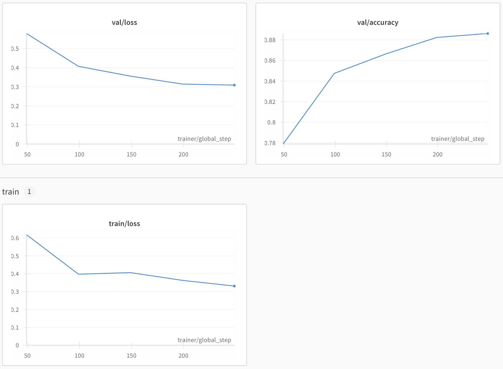
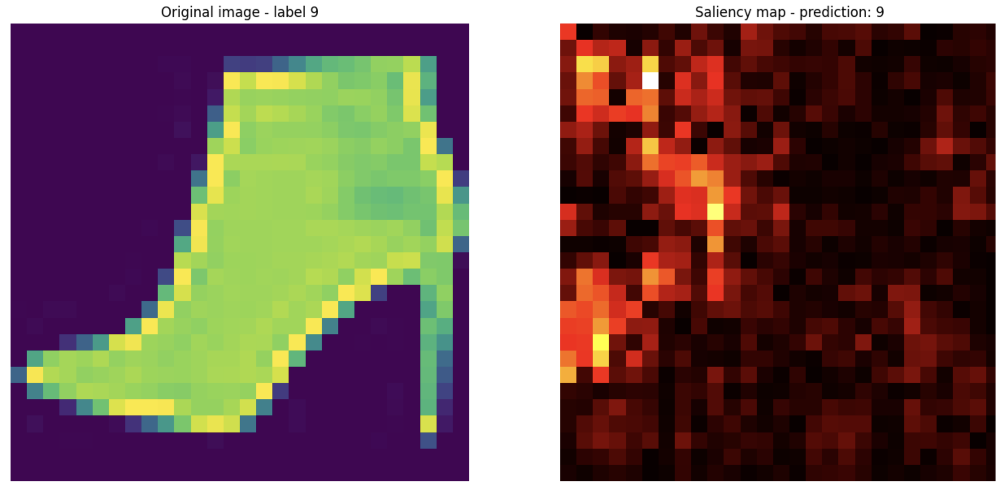
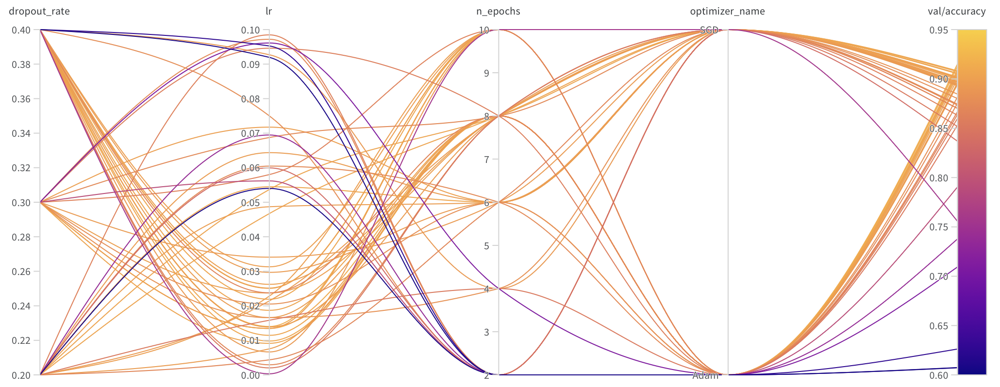
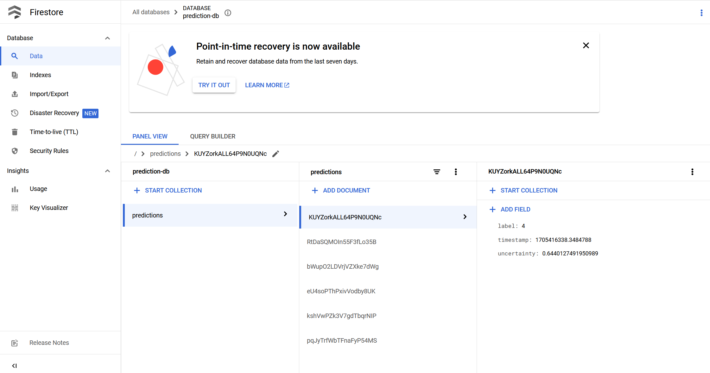
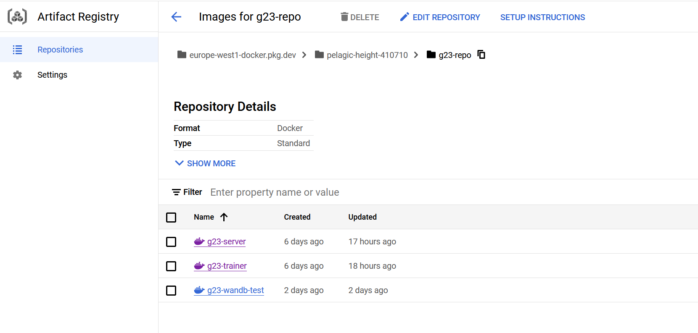
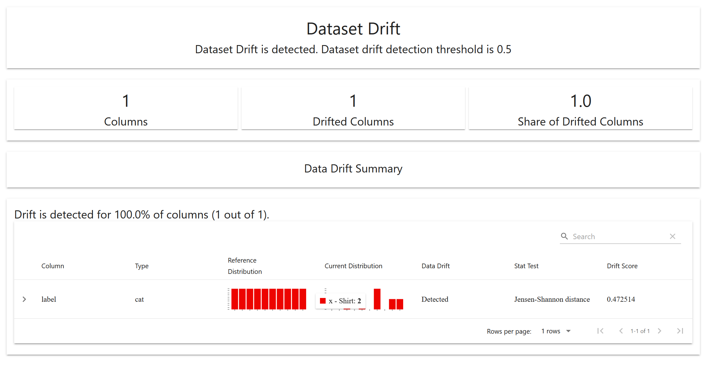
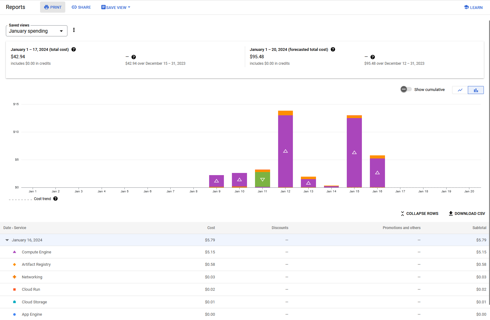
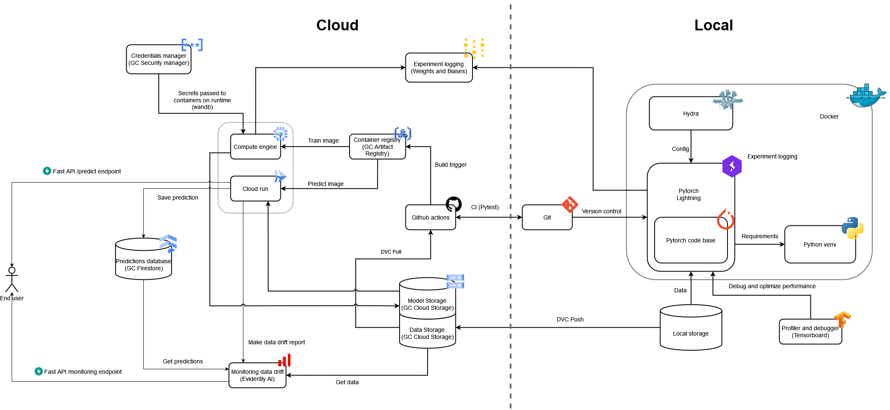

# Exam template for 02476 Machine Learning Operations

This is the report template for the exam. Please only remove the text formatted as with three dashes in front and behind
like:

```--- question 1 fill here ---```

where you instead should add your answers. Any other changes may have unwanted consequences when your report is auto
generated in the end of the course. For questions where you are asked to include images, start by adding the image to
the `figures` subfolder (please only use `.png`, `.jpg` or `.jpeg`) and then add the following code in your answer:

```markdown

```

In addition to this markdown file, we also provide the `report.py` script that provides two utility functions:

Running:

```bash
python report.py html
```

will generate an `.html` page of your report. After deadline for answering this template, we will autoscrape
everything in this `reports` folder and then use this utility to generate an `.html` page that will be your serve
as your final handin.

Running

```bash
python report.py check
```

will check your answers in this template against the constrains listed for each question e.g. is your answer too
short, too long, have you included an image when asked to.

For both functions to work it is important that you do not rename anything. The script have two dependencies that can
be installed with `pip install click markdown`.

## Overall project checklist

The checklist is *exhaustic* which means that it includes everything that you could possible do on the project in
relation the curricilum in this course. Therefore, we do not expect at all that you have checked of all boxes at the
end of the project.

### Week 1

* [X] Create a git repository
* [X] Make sure that all team members have write access to the github repository
* [X] Create a dedicated environment for you project to keep track of your packages
* [X] Create the initial file structure using cookiecutter
* [X] Fill out the `make_dataset.py` file such that it downloads whatever data you need and
* [X] Add a model file and a training script and get that running
* [X] Remember to fill out the `requirements.txt` file with whatever dependencies that you are using
* [(X)] Remember to comply with good coding practices (`pep8`) while doing the project
* [ ] Do a bit of code typing and remember to document essential parts of your code
* [X] Setup version control for your data or part of your data
* [X] Construct one or multiple docker files for your code
* [X] Build the docker files locally and make sure they work as intended
* [X] Write one or multiple configurations files for your experiments
* [X] Used Hydra to load the configurations and manage your hyperparameters
* [ ] When you have something that works somewhat, remember at some point to to some profiling and see if you can optimize your code
* [X] Use Weights & Biases to log training progress and other important metrics/artifacts in your code. Additionally,
      consider running a hyperparameter optimization sweep.
* [X] Use Pytorch-lightning (if applicable) to reduce the amount of boilerplate in your code

### Week 2

* [X] Write unit tests related to the data part of your code
* [X] Write unit tests related to model construction and or model training
* [X] Calculate the coverage.
* [X] Get some continuous integration running on the github repository
* [X] Create a data storage in GCP Bucket for you data and preferable link this with your data version control setup
* [X] Create a trigger workflow for automatically building your docker images
* [X] Get your model training in GCP using either the Engine or Vertex AI
* [X] Create a FastAPI application that can do inference using your model
* [%] If applicable, consider deploying the model locally using torchserve
* [%] Deploy your model in GCP using either Functions or Run as the backend

### Week 3

* [X] Check how robust your model is towards data drifting
* [X] Setup monitoring for the system telemetry of your deployed model
* [ ] Setup monitoring for the performance of your deployed model
* [%] If applicable, play around with distributed data loading
* [%] If applicable, play around with distributed model training
* [%] Play around with quantization, compilation and pruning for you trained models to increase inference speed

### Additional

* [ ] Revisit your initial project description. Did the project turn out as you wanted?
* [ ] Make sure all group members have a understanding about all parts of the project
* [ ] Uploaded all your code to github

## Group information

### Question 1
> **Enter the group number you signed up on <learn.inside.dtu.dk>**
>
> Answer:

23

### Question 2
> **Enter the study number for each member in the group**
>
> Example:
>
> *sXXXXXX, sXXXXXX, sXXXXXX*
>
> Answer:

*s204509,  s204125, s204138, s200925, s204503*

### Question 3
> **What framework did you choose to work with and did it help you complete the project?**
>
> Answer length: 100-200 words.
>
> Example:
> *We used the third-party framework ... in our project. We used functionality ... and functionality ... from the*
> *package to do ... and ... in our project*.
>
> Answer:

We used the open-sourced third-party framework *pytorch-lightning* to help reduce boilerplate and make it easier to get training up and running. This made it much easier to set up the training and validation loops. The entire training loop was reduced from a long, error-prone function to just a few fool-proof lines of code.

Pytorch Lightning also automated training with hardware accelerators, such as GPUs. This was especially valuable when training in the cloud, where it made it easier to switch between the various available underlying hardware.

We also used the *Pytorch Image Models* library (TIMM), which comes with a wide variety of Deep Learning image model architectures. 
We used this to easily incorporate different models in our experiments, as the models have the same interface.


## Coding environment

> In the following section we are interested in learning more about you local development environment.

### Question 4

> **Explain how you managed dependencies in your project? Explain the process a new team member would have to go**
> **through to get an exact copy of your environment.**
>
> Answer length: 100-200 words
>
> Example:
> *We used ... for managing our dependencies. The list of dependencies was auto-generated using ... . To get a*
> *complete copy of our development environment, one would have to run the following commands*
>
> Answer:

A new team member would first have to clone the repository from Github using the command:

```git clone https://github.com/MLOpsGroup23/MLOps-Project/```

Then, he would have to create a virtual environment in Python:

```python -m venv venv```

After activating the virtual environment, he would have to install the requirements using the command:

```pip install -r requirements.txt```

In addition, to run and test locally, `gcloud` would have to be installed in accordance to the installation guidelines on their website. This is done automatically when using the dockerfiles in our cloud environments.

This should provide a working environment for the project.

### Question 5

> **We expect that you initialized your project using the cookiecutter template. Explain the overall structure of your**
> **code. Did you fill out every folder or only a subset?**
>
> Answer length: 100-200 words
>
> Example:
> *From the cookiecutter template we have filled out the ... , ... and ... folder. We have removed the ... folder*
> *because we did not use any ... in our project. We have added an ... folder that contains ... for running our*
> *experiments.*
> Answer:

From the cookiecutter template we filled out all but one folder. The *notebooks* folder was left empty, as we did not get to create a notebook for our project.

The structure aligns well with the initial cookiecutter template. We added a folder named *dockerfiles*, which contains all the dockerfiles that have been used in the project. These include dockerfiles for creating docker images for:

1. Our server that users can interact with
2. Running a container for training models, which can be run on google cloud.

We also added a folder named *outputs*, which contains files used for logging and various other outputs. This is not meant to contain important files, but simply a directory used to store files for bookkeeping or testing.

### Question 6

> **Did you implement any rules for code quality and format? Additionally, explain with your own words why these**
> **concepts matters in larger projects.**
>
> Answer length: 50-100 words.
>
> Answer:

We did use pre-commits to ensure that our commits to our repository was of a certain quality. We used various pre-commit hooks from https://github.com/pre-commit/pre-commit-hooks in order to remove trailing whitespace, end-of-file newlines and additional hooks to make sure that no secret keys were added to the repository.

In addition, we used the *[ruff-pre-commit-hook](https://github.com/astral-sh/ruff-pre-commit)* in order to make sure that the python code that we added to the repository did not include unused packages, unused variables and so on.

## Version control

> In the following section we are interested in how version control was used in your project during development to
> corporate and increase the quality of your code.

### Question 7

> **How many tests did you implement and what are they testing in your code?**
>
> Answer length: 50-100 words.
>
> Example:
> *In total we have implemented X tests. Primarily we are testing ... and ... as these the most critical parts of our*
> *application but also ... .*
>
> Answer:

In total, we made 5 files, one for testing our data, model, prediction, training and visualize functionalities. Within these files, 16 tests were made.

We tried to test the most critical parts of our project, such as the models, the training loop, prediction functionalities. Many of the tests make sure that the output of different operations have the correct shape and correctly defined. For instance, if the different models were not producing valid outputs with the correct shapes, the entire application would break down.

### Question 8

> **What is the total code coverage (in percentage) of your code? If you code had an code coverage of 100% (or close**
> **to), would you still trust it to be error free? Explain you reasoning.**
>
> Answer length: 100-200 words.
>
> Example:
> *The total code coverage of code is X%, which includes all our source code. We are far from 100% coverage of our **
> *code and even if we were then...*
>
> Answer:

In the end, we achieved a total code coverage of $70\%$. Many of the files have $100\%$ coverage and almost all files have above $80\%$ coverage.

However, our FastAPI server and its interface with Google Cloud Firestore has not been tested. Also, our WANDB sweeping functionality was not tested with Pytest. Although testing our server and its endpoints is important, but we have prioritized testing our model (and the adjacent components, such as data loading) during development, as we had an assumption that this would be the part of the code that changed the most from commit to commit. FastAPI has a good testing framework, which could be used in the future, if the frontend is built out.

Even though we have high code coverage, we cannot know if the application is error free. For instance, most of our testing provides input to different functions. Since these inputs do not cover the entire input-space, we can never truly know if our application works with all inputs. This is especially problematic if others use the application, as they will likely at some points try very different inputs than the range of inputs we have considered reasonable during development.

### Question 9

> **Did you workflow include using branches and pull requests? If yes, explain how. If not, explain how branches and**
> **pull request can help improve version control.**
>
> Answer length: 100-200 words.
>
> Example:
> *We made use of both branches and PRs in our project. In our group, each member had an branch that they worked on in*
> *addition to the main branch. To merge code we ...*
>
> Answer:

Yes, we did use branches and pull requests during development. We disabled the ability to push directly into the main branch. Thus, all changes into the main branch needed to go through a pull request.

Furthermore, we added branch protection in the form of a requirement that every pull request had to be approved by another group member. This way, we ensured that a rogue group member could not destroy the main branch by themselves. Also, if the person creating the pull request had mistankly pushed broken code, the error is more likely to be found.
In addition to this, we also added a CI testing step to Github Actions, which automatically runs our tests whenever a pull request is made.

For branches, we simply created a new branch for every feature we wanted to implement. When the feature was implemented we typically made sure to merge the newest changes from main into our feaure branches. By doing this, we ensured that potential merge conflicts were resolved in the feature branch before creating the pull request to the main branch. This made it much easier to see when each feature was implemented and made it easier to track who was working on what.

### Question 10

> **Did you use DVC for managing data in your project? If yes, then how did it improve your project to have version**
> **control of your data. If no, explain a case where it would be beneficial to have version control of your data.**
>
> Answer length: 100-200 words.
>
> Example:
> *We did make use of DVC in the following way: ... . In the end it helped us in ... for controlling ... part of our*
> *pipeline*
>
> Answer:

Yes, we did use DVC together with Google Cloud Storage to store our larger data files. We used it to track our training and validation datasets. This made it very easy to share our datasets, and made it easier to control which version of the data we were working on as we would just push new code and the pointer to the dataset used in the code and/or generated by the code would be updated.

Another benefit of using DVC was seen when using Github Actions. For continuous integration, we added Github Actions to build and store different Docker images every time a new push to main was made. Some of these images required the dataset to work properly. By using DVC, it was easy to pull the newest data and make sure that the correct dataset was used in the different images.

### Question 11

> **Discuss you continues integration setup. What kind of CI are you running (unittesting, linting, etc.)? Do you test**
> **multiple operating systems, python version etc. Do you make use of caching? Feel free to insert a link to one of**
> **your github actions workflow.**
>
> Answer length: 200-300 words.
>
> Example:
> *We have organized our CI into 3 separate files: one for doing ..., one for running ... testing and one for running*
> *... . In particular for our ..., we used ... .An example of a triggered workflow can be seen here: <weblink>*
>
> Answer:

As described in question 7, we use Pytest to unittest our code. These tests have been automated via. Github Actions, such that every pull request has to pass these tests before being able to merge them into main.

Also, as described in question 6, we use pre-commit hooks in order to enforce some formatting using *ruff*. 

Github Actions allows you to run these tests for multiple operating systems and multiple python versions. However, we use the *Ubuntu* operating system and Python version 3.10. For future use, it might be wise to perform the tests on several operating systems and Python versions. However, this is mainly useful if you have an assumption that your code will be running in different environments, which we did not, as we knew we would be serving our code via a Docker container, which we had full control over.

We also used used Github Actions in order to generate our Docker Images for the server and trainer container. When these are made, they are pushed to our GCP Artifact Registry storage (Container Storage seemed to be deprecated during the duration of this project?). In this way, we avoid using the Google Cloud Build service. For the prediction server, this Docker image is afterwards launched in Google Cloud Run, which automatically runs the container and thus launches the newest version of the prediction server. More details on this in question 22. 

In this way, we also have a large selection of different versions of our Docker images to choose from and revert back to, if some functionality should break in the future. 

By following [this link](https://github.com/MLOpsGroup23/MLOps-Project/blob/main/.github/workflows/tests.yml) you can view one of our workflow files, which was used to run the different tests. Notice that it uses DVC in order to pull the newest data. It also automatically installs the needed requirements. It also caches the dependencies such that it does not need to spend time downloading all the python packages for each Github Action.

## Running code and tracking experiments

> In the following section we are interested in learning more about the experimental setup for running your code and
> especially the reproducibility of your experiments.

### Question 12

> **How did you configure experiments? Did you make use of config files? Explain with coding examples of how you would**
> **run a experiment.**
>
> Answer length: 50-100 words.
>
> Example:
> *We used a simple argparser, that worked in the following way: python my_script.py --lr 1e-3 --batch_size 25*
>
> Answer:

We configured experiments using .yaml files and hydra. The setup includes a model agnostic configuration with parameters pertaining to data loading and augmentations, the number of epochs, etc. Model specific configurations are also included and they contain the model class along with hyper parameters.

To train a model locally of a particular architecture one would have to alter the config.yaml file specifying the architecture. Hereafter one would run `python train_model.py` in the project folder to train. Alternatively, running `$make train` would achieve the same effect.

Further, we augmented our Docker training container to pass in arguments to Hydra when calling `docker run` - this made it possible to reuse a single Docker image for experimenting with different model architectures and hyperparameters, locally and in the cloud.

### Question 13

> **Reproducibility of experiments are important. Related to the last question, how did you secure that no information**
> **is lost when running experiments and that your experiments are reproducible?**
>
> Answer length: 100-200 words.
>
> Example:
> *We made use of config files. Whenever an experiment is run the following happens: ... . To reproduce an experiment*
> *one would have to do ...*
>
> Answer:

To get insight into training dynamics and keep track of experiment parameters we use WANDB. Whenever an experiment is run, the hyperparameters are logged along with loss and accuracy on the training and validation sets. To reproduce an experiment one has to specify the model architecture and its hyperparameters in the config files. Hereafter the procedure follows the previous point.

### Question 14

> **Upload 1 to 3 screenshots that show the experiments that you have done in W&B (or another experiment tracking**
> **service of your choice). This may include loss graphs, logged images, hyperparameter sweeps etc. You can take**
> **inspiration from [this figure](figures/wandb.png). Explain what metrics you are tracking and why they are**
> **important.**
>
> Answer length: 200-300 words + 1 to 3 screenshots.
>
> Example:
> *As seen in the first image when have tracked ... and ... which both inform us about ... in our experiments.*
> *As seen in the second image we are also tracking ... and ...*
>
> Answer:





As seen in the first image we track the training dynamics of our system. This enables us to assess how well the model generalizes and identify if over- or under fitting occurs. 





From the second image, we see an input image and the corresponding saliency map which has been logged to Wandb. We create a saliency map for an image from each class during each epoch. This gives us insight into how the model makes its predictions. In this particular example, it is clear that the model places most emphasis on regions where the boot is not present. 





As seen in the third image, a hyper parameter sweep is performed to maximize the accuracy on the validation dataset. This helps us assess which hyperparameters are optimal for different model architectures. We opted for using Bayesian Optimization when searching over the parameter space and we optimize for the learning rate, dropout probability, number of epochs and choice of optimizer. 


### Question 15

> **Docker is an important tool for creating containerized applications. Explain how you used docker in your**
> **experiments? Include how you would run your docker images and include a link to one of your docker files.**
>
> Answer length: 100-200 words.
>
> Example:
> *For our project we developed several images: one for training, inference and deployment. For example to run the*
> *training docker image: `docker run trainer:latest lr=1e-3 batch_size=64`. Link to docker file: <weblink>*
>
> Answer:

Our project uses two main Docker images, which are defined in the dockerfiles `train_model.dockerfile` and `fastapi_predict.dockerfile`. 

[`train_model.dockerfile`](https://github.com/MLOpsGroup23/MLOps-Project/blob/new-trainer-container/dockerfiles/train_model.dockerfile) defines an image which is intended to be run on a Google Cloud Engine VM. As briefly mentioned in question 12, we have designed it to be reusable for training all of our different model types, and easily configure hyperparameters and other training settings (e.g. save directory for models), by simply passing a string containing Hydra arguments as an environment variable to the `docker run` command.
The full command (assuming GPUs available) is:
```bash
docker run --gpus all -v {LOCAL DIR}:{MODEL SAVE LOCATION} -e HYDRA_ARGS={ARGS TO HYDRA} --rm {IMAGE ID}
```

Some of the available HYDRA_ARGS are 
- `data.num_workers={int}`
- `architecture=[visiontransformer|resnet|mobilenet|efficientnet|vgg|xcitnano]`
- `training.max_epochs={int}`

They are passed as a space-separated string.


[`fastapi_predict.dockerfile`](https://github.com/MLOpsGroup23/MLOps-Project/blob/main/dockerfiles/fastapi_predict.dockerfile) defines an image intended to be run using Google Cloud Run, for serving our prediction endpoints, exposing our selected trained model.

### Question 16

> **When running into bugs while trying to run your experiments, how did you perform debugging? Additionally, did you**
> **try to profile your code or do you think it is already perfect?**
>
> Answer length: 100-200 words.
>
> Example:
> *Debugging method was dependent on group member. Some just used ... and others used ... . We did a single profiling*
> *run of our main code at some point that showed ...*
>
> Answer:

For debugging of the codebase, all group members of the project used the built-in python debugger. Thus, no "print('HERE')" statements were used.

We did not use or implement any profiling of the codebase. However, for future improvements we would profile the logic for the inference part of the codebase, to gain an understanding of the performance of our inference pipeline.

## Working in the cloud

> In the following section we would like to know more about your experience when developing in the cloud.

### Question 17

> **List all the GCP services that you made use of in your project and shortly explain what each service does?**
>
> Answer length: 50-200 words.
>
> Example:
> *We used the following two services: Engine and Bucket. Engine is used for... and Bucket is used for...*
>
> Answer:


<h4>
  
  Compute engine
</h4>
We used Google Cloud's (GC) Compute engine to run our containerized training script. This was done by creating a VM instance with a T4 GPU.
The training image is pulled from the Artifact registry and run manually. It pulls a WANDB API key from the Security Manager to log the training to Weights and Biases.
The data comes from a bucket in Cloud Storage, but is already in the image as Github Actions pulls the data, adds it to the image build and pushes it to the Artifact registry. This could be done differently, but was not prioritized as it does not pose security concerns like with API-key.


<h4>
  
  Cloud run
</h4>
We use cloud run to host the predict container, which provides FastAPI endpoints for end user predictions. It retrieves the model from a Cloud Storage bucket.
Every prediction on uploaded user data is saved in Firestore to be able to make data drifting reports.

<h4>
  
  Firestore
</h4>
Firestore is used to store predictions made in Cloud run. We used this at is scalable and we in theory could save the whole images uploaded if needed.


<h4>
  
  Cloud storage
</h4>
A bucket in Cloud Storage is used to save the version controlled data and models saved by the VM in Compute Engine. Github Actions pulls data from here when creating a train image.


<h4>
  
  Artifact registry
</h4>
The Artifact Registry is used to store both train and predict images.

<h4>
  
  Security manager
</h4>
The security manager is used to store secrets (API keys) used on container runtime. This is better practise than saving the keys as part of the image.

### Question 18

> **The backbone of GCP is the Compute engine. Explained how you made use of this service and what type of VMs**
> **you used?**
>
> Answer length: 100-200 words.
>
> Example:
> *We used the compute engine to run our ... . We used instances with the following hardware: ... and we started the*
> *using a custom container: ...*
>
> Answer:

We used the Compute Engine to run our containerized train image pulled from the Artifact Registry. As described it also pulls secrets from Secret Manager on container runtime.
We used a virtual machine of type `n1-standard-2` on the `Intel Broadwell` platform and one `NVIDIA T4`.
We started with a CPU-only virtual machine, but this was not enough for our training needs, and we requested a GPU quota which took some time. And even with the quota it was hard to locate a server with available GPUs.

To run a training pull the latest image from the artifact registry:

```bash
docker pull europe-west1-docker.pkg.dev/pelagic-height-410710/g23-repo/g23-trainer:latest
```

Before spinning up the container, make sure Docker has access to the service account connected that the VM uses (we made a custom service account to be selective about access):

```bash
sudo usermod -a -G docker ${USER}
```

Now that the image is pulled from the Artifact registry, run a container from the image, for example using:

```bash
docker run --gpus all -v $(pwd)/models:/models -e HYDRA_ARGS="data.num_workers=2 architecture=visiontransformer training.max_epochs=10" --rm {IMAGE ID}
```

Now the training should run and log to Weights and Biases! 🚀


### Question 19

> **Insert 1-2 images of your GCP bucket, such that we can see what data you have stored in it.**
> **You can take inspiration from [this figure](figures/bucket.png).**
>
> Answer:

Below the screenshot of our bucket can be seen. The version controlled data can be found in the `data` folder and the models are saved by the train containers on the VM into the root of the bucket.


Additionally, we used Firestore to save predictions made by the trained model.




### Question 20

> **Upload one image of your GCP container registry, such that we can see the different images that you have stored.**
> **You can take inspiration from [this figure](figures/registry.png).**
>
> Answer:

Below is an image showing the images stored in the artifact registry:


### Question 21

> **Upload one image of your GCP cloud build history, so we can see the history of the images that have been build in**
> **your project. You can take inspiration from [this figure](figures/build.png).**
>
> Answer:

We did not use Cloud Build in this project, but used Github Actions to build images instead. From here they are also pushed automatically to the Artifact Registry on Google Cloud.
See: [Actions](https://github.com/MLOpsGroup23/MLOps-Project/actions)

### Question 22

> **Did you manage to deploy your model, either in locally or cloud? If not, describe why. If yes, describe how and**
> **preferably how you invoke your deployed service?**
>
> Answer length: 100-200 words.
>
> Example:
> *For deployment we wrapped our model into application using ... . We first tried locally serving the model, which*
> *worked. Afterwards we deployed it in the cloud, using ... . To invoke the service an user would call*
> *`curl -X POST -F "file=@file.json"<weburl>`*
>
> Answer:

We did manage to deploy our model in the cloud and locally. In both cases, *uvicorn* and *FastAPI* was used to setup and implement a server that uses the model. The server could easily be tested locally by running a *uvicorn* command. The model used in deployment was stored in our Google Cloud Bucket, which made it easy to be downloaded both locally and in the cloud. For running the service in the cloud, we build a docker image for a container that runs the server. This image was then run in the cloud using the *Cloud Run* service. This step was automated as a part of our continous integration step, as explained in question 11.

The server exposed three endpoints, one for the homepage, one for predicting images, and one for the Evidently AI report. Using the *root/predict* endpoint, POST requests with a payload of a *.BMP* image could be made, which response would be a preidction of the image. This was also available from the homepage with a very basic user interface.

The deployment is available at this URL: https://g23-server-3is7zysmoq-ew.a.run.app. (It might take a minute to start on the first visit.)
The evidently data monitoring report is available at this URL: https://g23-server-3is7zysmoq-ew.a.run.app/monitoring. We only show the label distribution of the images predicted against the actual dataset distribution.

A collection of MNIST fashion images in BMP format can be downloaded from [HERE](https://drive.google.com/file/d/1LLOEuGN3nTlgYA4r9mQNnUdAdYI-Z6a3/view?usp=sharing). These are 100 random images from our test set, which can be used in our predict endpoint or the homepage of the server.

### Question 23

> **Did you manage to implement monitoring of your deployed model? If yes, explain how it works. If not, explain how**
> **monitoring would help the longevity of your application.**
>
> Answer length: 100-200 words.
>
> Example:
> *We did not manage to implement monitoring. We would like to have monitoring implemented such that over time we could*
> *measure ... and ... that would inform us about this ... behaviour of our application.*
>
> Answer:


<h4>Data Drifting</h4>

To monitor how our data changes and what the model predicts compared to the reference distribution, i.e. what the model was trained on, we combine tools from Evidently with a Firestore DB.
As explained earlier, when our predict endpoint is invoked, we save the model's predictions to Firestore. We can then use [Evidently AI](https://www.evidentlyai.com/) to create a report, i.e. we compare our distribution of the data in the Google Cloud Bucket to the predictions saved in Firestore.

At this point, we only look at the label distribution. For future development we would save the images uploaded by the end user in a Bucket and point to them from Firebase (i.e. image URL). Then we could compare different image statistics between the uploaded images and the reference data. We could use the [ImageStat](https://pillow.readthedocs.io/en/stable/reference/ImageStat.html) module to calculate some basic statistics.

The monitoring dashboard can be found at:
https://g23-server-3is7zysmoq-ew.a.run.app/monitoring.

Below is a screenshot of the Evidently report generated:



<h4>System Monitoring</h4>

For monitoring of our system, we implemented service level objectives of our Cloud Run service, as well as Google Cloud Monitoring alerting policies. For the service level objectives, we set an objective of $95\%$ availability of our endpoint, alongside an objective of $95\%$ Latency, with a threshold of $70ms$. For the alerting policies, we set a $5$ minute rate rolling window for the billable instance time, with a threshold of $0.5s$, and a $5$ minute rate rolling window for the number of endpoint requests with a threshold of $5$ requests. All above systems monitoring policies are set to send an email alert to all team members, if any of the mentioned thresholds are exceeded.

### Question 24

> **How many credits did you end up using during the project and what service was most expensive?**
>
> Answer length: 25-100 words.
>
> Example:
> *Group member 1 used ..., Group member 2 used ..., in total ... credits was spend during development. The service*
> *costing the most was ... due to ...*
>
> Answer:

As of 17/1/2024 13:40 we used $42.94 and we expect to use all $50 that we got as part of the project. We might have to buy more credit or find a solution to move the project to another billing account.

Our billing overview for the mentioned period can be seen below:




## Overall discussion of project

> In the following section we would like you to think about the general structure of your project.

### Question 25

> **Include a figure that describes the overall architecture of your system and what services that you make use of.**
> **You can take inspiration from [this figure](figures/overview.png). Additionally in your own words, explain the**
> **overall steps in figure.**
>
> Answer length: 200-400 words
>
> Example:
>
> *The starting point of the diagram is our local setup, where we integrated ... and ... and ... into our code.*
> *Whenever we commit code and puch to github, it auto triggers ... and ... . From there the diagram shows ...*
>
> Answer:

The overall architecture of the project can be seen below:


As can be seen, we use PyTorch and PyTorch Lightning and use Hydra for config storing. 
- Python's venv is used to ensure reproducibility although some users preferred Conda. As long as the requirements are met, both should work. 
- This is all packaged in a Docker image which is built by GitHub Actions if all Pytest tests work. Two images are built: predict and train.
- When preprocessing data, it is pushed to a bucket in Cloud Storage with DVC, which is pulled by GitHub Actions when building the image (this could be optimized).
- The built images are pushed to the Artifact Registry in Google Cloud. 
- GitHub Actions makes sure that the predict image is deployed automatically, while the train image has to be manually deployed from the Compute Engine VM's SSH terminal. 
- Logs are stored in Weights and Biases while training using an API key stored in Secrets Manager. GitHub Actions also has secrets stored.
- When a model has been trained, we have chosen a manual flow for selecting whether it should replace the one at the predict endpoint.
If we choose to do so, we simply move the trained model (`cp {MODEL.ckpt} {PATH_TO_MOUNTED_BUCKET}`) to the Google Cloud bucket (which is mounted to the VM). 
- The predict container retrieves the model from the bucket and serves it to the user through a FastAPI endpoint. When a prediction is made, it will be stored in Firebase such that an Evidently AI report can be made to assess data drifting.


### Question 26

> **Discuss the overall struggles of the project. Where did you spend most time and what did you do to overcome these**
> **challenges?**
>
> Answer length: 200-400 words.
>
> Example:
> *The biggest challenges in the project was using ... tool to do ... . The reason for this was ...*
>
> Answer:

The thing we struggled with the most was the integration of all the various components on Google Cloud. 
Especially making the training container run like we envisioned it, in a Docker container on the Compute Engine VM. 
We had an issue between Pytest and Docker. Pytest imports the module MLOps_Project successfully, but when we build a docker image, it does not recognize the package even though we have installed it as a Python module. Due to this issue we have the project defined in two branches, one for the train image: [new-trainer-container](https://github.com/MLOpsGroup23/MLOps-Project/tree/new-trainer-container) and another for the rest of the project: [main](https://github.com/MLOpsGroup23/MLOps-Project/tree/main). If we had more time, we would have fixed this issue.

We also struggled when integrating Hydra with Weights and Biases as these can sometimes work against each other. We ended up not using the decorators provided by Hydra everywhere, but instead we used function calls to get the config which we could then pass to WANDB to log the experiment data. 

Additionally, the choice of getting the credentials for Weights and Biases on runtime instead of saving it in the image with Github Actions posed some challenges. We had to figure out how to make sure the Docker container had the correct access which included creating a new custom service account for the virtual machine and then allowing Docker access to this user. Logging in to Weights and Biases on runtime then consisted of installing gcloud in the docker image and then running an entrypoint shell script to get credentials on docker runtime.


### Question 27

> **State the individual contributions of each team member. This is required information from DTU, because we need to**
> **make sure all members contributed actively to the project**
>
> Answer length: 50-200 words.
>
> Example:
> *Student sXXXXXX was in charge of developing of setting up the initial cookie cutter project and developing of the*
> *docker containers for training our applications.*
> *Student sXXXXXX was in charge of training our models in the cloud and deploying them afterwards.*
> *All members contributed to code by...*
>
> Answer:

All members contributed across the various parts of the project, such as the codebase, version control, CI, cloud solutions and monitoring. Some members were more focused on some aspects than others, however, no member was in charge of / responsible for a project aspect alone. This task delegation was chosen to gain the most experience as possible from the project.